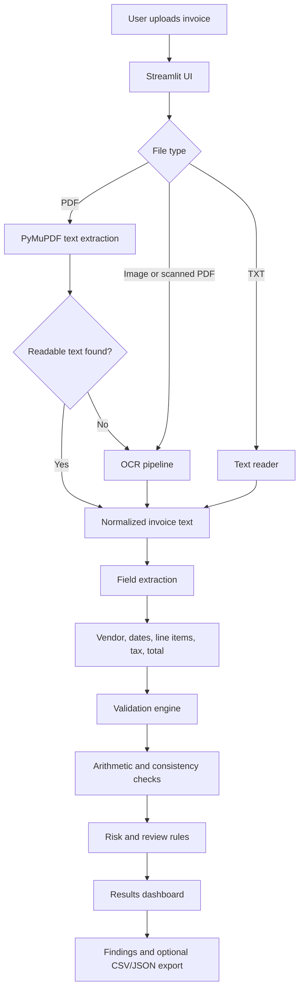

# InvoiceGuard AI 🧾

**AI-powered invoice extraction, validation, and risk screening built with Python and Streamlit.**

InvoiceGuard AI extracts key fields from invoices, validates arithmetic, identifies inconsistencies, and highlights items for human review. It supports text-based PDFs and can use OCR for scanned documents.

> **Important:** This project provides decision support, not a definitive fraud determination. A risk score is a heuristic, not a probability of fraud.

## ✨ Features

- Upload invoice documents for analysis.
- Extract selectable text from PDFs and use OCR for scanned PDFs or images.
- Extract vendor, invoice number, dates, line items, subtotal, tax, and total where available.
- Validate line-item calculations and compare subtotal, tax, and grand total.
- Flag missing fields, extraction uncertainty, and arithmetic inconsistencies separately.
- Display findings and a review status in a Streamlit interface.
- Optional CSV/JSON export and analysis history, depending on the implemented version.

## 🧱 Architecture



### Component responsibilities

| Component | Responsibility |
|---|---|
| Streamlit UI | File upload, errors, results display |
| Document reader | Read PDFs and supported file types |
| OCR pipeline | Read scanned PDFs and images when native text is unavailable |
| Field extractor | Identify vendor, invoice metadata, line items, tax, and totals |
| Validation engine | Recalculate line totals and compare subtotal, tax, and total |
| Risk/review engine | Explain flags based on missing data and inconsistencies |
| Results layer | Show extracted fields, validation results, findings, and exports |

## 🔄 Processing workflow

1. **Upload:** The user uploads a supported invoice.
2. **Read:** The app tries native PDF text extraction first.
3. **OCR fallback:** If the PDF has no usable text, the app attempts OCR.
4. **Extract:** Parsing logic identifies invoice fields.
5. **Validate:** The system recalculates line totals and checks stated totals.
6. **Assess:** Findings are produced for mismatches, missing fields, or uncertain extraction.
7. **Review:** The user checks the extracted text and results before deciding.

## 🛠️ Tech stack

- **Language:** Python
- **UI:** Streamlit
- **PDF parsing:** PyMuPDF (`fitz`)
- **OCR:** Tesseract OCR, `pytesseract`, `pdf2image`
- **Image handling:** Pillow
- **Parsing and validation:** Python regular expressions and decimal arithmetic
- **Data export:** CSV/JSON, if enabled in your implementation

## 🚀 Getting started

### 1. Clone the repository

```bash
git clone https://github.com/YOUR-USERNAME/invoiceguard-ai.git
cd invoiceguard-ai
```

Replace `YOUR-USERNAME` with your GitHub username.

### 2. Create and activate a virtual environment

**Windows (PowerShell):**

```powershell
python -m venv .venv
.\.venv\Scripts\Activate.ps1
```

**macOS/Linux:**

```bash
python3 -m venv .venv
source .venv/bin/activate
```

### 3. Install Python dependencies

If the repository contains `requirements.txt`:

```bash
python -m pip install -r requirements.txt
```

Otherwise, install the core packages:

```bash
python -m pip install streamlit pymupdf pytesseract pdf2image pillow
```

### 4. Install OCR system dependencies

For scanned documents, install **Tesseract OCR** and ensure it is on your system `PATH`. Install **Poppler** if your `pdf2image` setup requires it, and configure its binary path if necessary. Text-based PDFs may work without OCR dependencies.

### 5. Run the app

If your Streamlit entry point is `app.py`:

```bash
streamlit run app.py
```

If your entry point has another name, replace `app.py` with that filename.

## 🧪 Testing

Test with:

- Text-based PDF invoices
- Scanned PDF invoices
- PNG/JPG invoice images
- Documents with missing vendor or total fields
- Corrupt, empty, or unsupported files
- Invoices with incorrect line totals or mismatched tax/grand totals

Example synthetic regression cases:

| Case | Line items | Subtotal | GST | Grand total | Expected |
|---|---:|---:|---:|---:|---|
| Incorrect sample | ₹1,350 + ₹400 + ₹600 | ₹2,350 | ₹423 | ₹2,700 | Flag line-item and total inconsistencies |
| Correct sample | ₹1,350 + ₹400 + ₹500 | ₹2,250 | ₹405 | ₹2,655 | Arithmetic checks pass |

These are synthetic training examples. Extraction logic must use document content rather than hard-coding the example vendor or amounts.

## 📁 Suggested project structure

```text
invoiceguard-ai/
├── app.py                  # Streamlit application
├── requirements.txt        # Python dependencies
├── README.md               # Project documentation
├── src/
│   ├── document_reader.py  # PDF/text/image reading and OCR
│   ├── extractor.py        # Invoice field extraction
│   ├── validator.py        # Arithmetic and consistency checks
│   └── risk_engine.py      # Explainable review rules
├── tests/
│   ├── test_extractor.py
│   └── test_validator.py
└── samples/                # Optional synthetic test invoices only
```

This is a suggested structure. Adjust it to match the files that actually exist in your repository.

## 🔐 Privacy and responsible use

- Do not commit real invoices or customer data to a public repository.
- Use synthetic or anonymized documents for demos and tests.
- Avoid logging sensitive invoice contents unnecessarily.
- Treat extraction results as estimates that may require human review.
- A flagged invoice is not proof of fraud; verify it against source records.

## 🗺️ Roadmap

- Improve extraction across different invoice layouts.
- Add automated unit tests for extraction and arithmetic validation.
- Add confidence indicators and explainable findings.
- Support batch invoice processing.
- Add CSV/JSON export and configurable validation rules.
- Improve OCR handling for low-resolution and rotated scans.

## 🤝 Contributing

1. Fork the repository.
2. Create a feature branch.
3. Add tests for changes where possible.
4. Open a pull request with a clear description.

## 📄 License

Choose a license before distributing the project. For an open-source release, add a `LICENSE` file with the license you select.
